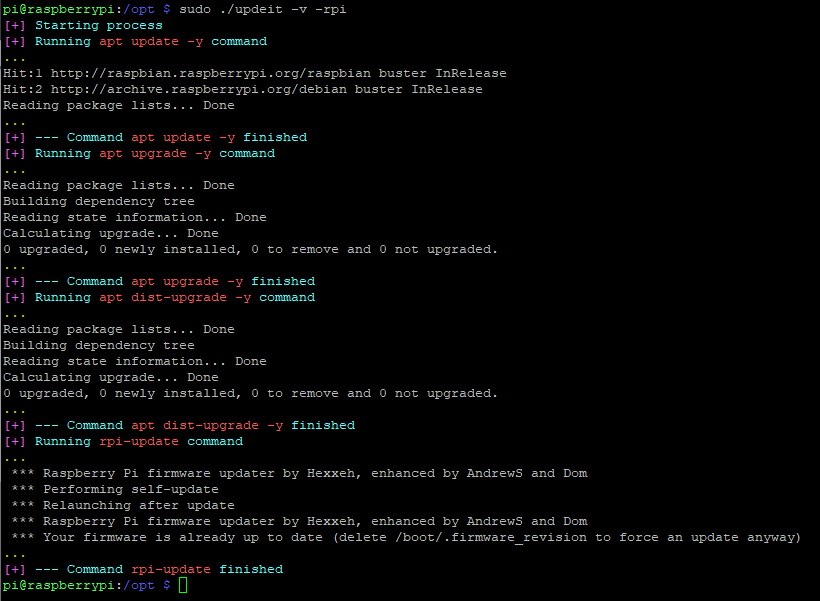

# updeit

## README Content
1. :notebook_with_decorative_cover: [Description](#description)
2. :warning: [Before running](#before-running)
3. :writing_hand: [Syntax](#syntax)
4. :bookmark_tabs: [Options](#options)
5. :monocle_face: [Preview](#options)
6. :page_with_curl: [License](#options)
7. :heart: [Contribution](#options)

## # Description

Bash script to update Debian-based | Ubuntu | Linux | Raspberry systems.

## # Before running

Download and place the script in the desired path. Then assign execute permissions to the script with the following command:

    sudo chmod +x ./updeit

If you want to  run the script from anywhere on the system, place the file in `/usr/local/bin` directory or add the folder where it is to the `$PATH` system variable.

## # Syntax

    updeit [OPTIONS]

## # Usage

Run the following command to start the update:

     sudo ./updeit

You can see default values in [options](#options) section

_Its recommended to run the command with sudo_

## # Options

You can use the following options:

    -rpi            update raspberry system. Note that user interaction may be required using this option (default: false)

    -v|--verbose    verbose mode (default: false)

    -h|--help       show help page

    --version       print script version and exit

## # Preview

Here you can see an example of script execution:

## # License

MIT

## # Contribution

:star: Feel free to contribute! :star: